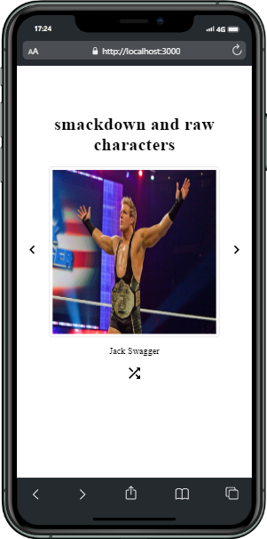
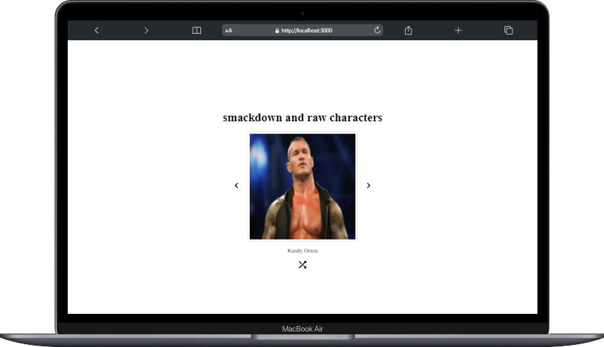

# React volkislider :

### Proje özeti :

> Proje React ile yazıldı image carousel

### Proje durumu ve yapılacaklar :

- [x] sayfa yenilendiğinde random resim gelmesi
- [x] geri button kontrolü
- [x] ileri button kontrolleri
- [x] responsive tasarım

### Projede kullanılan Teknolojiler ve Metotlar :

> Projede useState, useEffect hook kullanıldı.
> stilendirme için herhangi bir kütüphane kullanılmadı pure css ile stilendirme yapıldı.
> react icons kullanıldı
> deploy için vercel kullanıldı.

### Proje Adresi

[volkislider](https://volkislider.vercel.app/)

### Projenin Görselleri:

